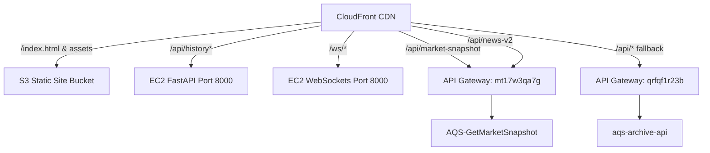

# AQS System Architecture Blueprint

This document details the production architecture of the **Atlas Quant Systems (AQS)** automated data bridge, AI reporting swarm, and frontend distribution pipeline.

---

## 1. Network Routing & CDN (CloudFront)
AQS uses a unified CloudFront distribution ID **`E14OIXL39MD9NW`** as the public gateway. It handles caching and routes requests dynamically based on path patterns:

### Path Mappings & Cache Behaviors
* **S3 Static Website Origin:** `aqs-dev-public-site-706922780929-use1`
  * Serves frontend files (`gex.html`, assets, stylesheets, scripts).
* **EC2 Ingestion API Origin:** `ec2-100-59-18-121.compute-1.amazonaws.com` (Port 8000)
  * `/api/history*` -> Direct read from local Redis cache (`aqs:snapshot`).
  * `/ws/*` -> Real-time quote streaming.
* **AWS Lambda API Gateways:**
  * `/api/market-snapshot` -> Invokes `AQS-GetMarketSnapshot` Lambda to query active pricing from DynamoDB.
  * `/api/news-v2` & `/api/news` -> Invokes news readers.
  * `/api/*` -> Routes to `aqs-archive-api` for historical data storage.

---

## 2. Data Acquisition Loop (EC2 Host)
The primary data bridge runs on EC2 instance `i-073339a060355bf96` (Name: `aqs-ibkr-gateway`). It executes two background systemd daemons:

1. **`aqs-ibkr-scheduler.service`:** Runs `/opt/aqs-ibkr-bridge/scheduler_engine.py`
   * Primary data source: **Charles Schwab API** (fetching 22 futures and 7 indices).
   * Relays live snapshots every 30 seconds (RTH) or 5 minutes (ETH).
   * Writes quotes to local Redis cache (`aqs:snapshot`) and updates the `aqs_market_telemetry` table in DynamoDB.
2. **`aqs-api-bridge.service`:** Runs Uvicorn FastAPI server on port 8000 (`main.py`)
   * Serves `/api/history` with sub-second response rates from Redis.
   * Manages WebSocket rooms for pushing real-time ticks.

---

## 3. AWS Bedrock AI Swarm (`bedrock_swarm.py`)
AQS integrates a parallel multi-agent swarm utilizing **AWS Bedrock** for market analysis and reporting. The orchestrator dispatches snapshots to specialized sub-agents:

* **Model Used:** `us.anthropic.claude-sonnet-4-5-20250929-v1:0` (Claude 4.5 Sonnet) via Bedrock cross-region inference.
* **Agent Swarm Directory:**
  1. `HARVESTER`: Parses market quotes, PCR ratios, and ticks.
  2. `GEX_MATH`: Calculates strike boundaries, notional Gamma/Delta levels.
  3. `MACRO_SURPRISE`: Synthesizes economic news, FRED charts, and sentiment indexes.
  4. `TELEMETRY_SENSOR`: Tracks data staleness, pipeline latency, and API error states.
* **Output:** Generates daily research summaries and delivers them to Discord webhooks.

---

## 4. Databases & Storage
* **DynamoDB (us-east-1):**
  * `aqs_market_telemetry`: Main database storing live quotes, indices, and calculated GEX levels. Primary Key: HASH `Category`, RANGE `Timestamp`.
  * `aqs_oauth_state`: Single-use, TTL-enabled (24 hour) tokens to authorize Schwab callback redirects.
  * `aqs_schwab_refresh_lock`: Atomic locking table to prevent concurrent token refreshes.
* **SSM Parameter Store:**
  * Holds configuration parameters: `/aqs/schwab/tokens`, `/aqs/schwab/app-key`, `/aqs/schwab/app-secret`, `/aqs/schwab/redirect-uri`, and `/aqs/discord/webhook-url`.

---

## 5. News & Economic Data Pipelines
* **`AQS-NewsReader` / `AQS-NewsIngester` Lambdas:** Periodically query external financial news sources, synthesize them using Bedrock, and write structured alerts to `aqs-news-v1` DynamoDB table.
* **`aqs-billing-daily-monitor`:** Daily monitor checking EC2 health, API call quotas, and billing thresholds.
